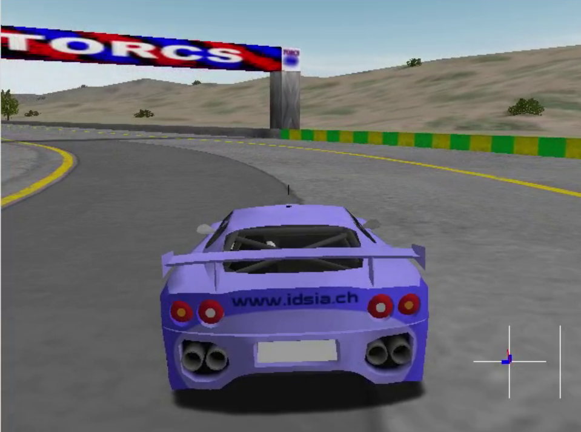

## How to install Torcs 


- xautomation (http://linux.die.net/man/7/xautomation)

    ```
    sudo apt-get update        
    sudo apt-get install xautomation
    ```

    ```
    sudo apt-get install libglib2.0-dev  libgl1-mesa-dev libglu1-mesa-dev  freeglut3-dev  libplib-dev  libopenal-dev libalut-dev libxi-dev libxmu-dev libxrender-dev  libxrandr-dev libpng12-dev 
    ```

- Gym-TORCS

  cd into the vtorcs-RL-color directory
    ```
    ./configure
    make
    sudo make install
    sudo make datainstall
    ```

- Initialization of the Race

    ```
    sudo torcs
    ```
    The GUI of TORCS should be launched. 
    Then go to `Race -> Quick Race -> Configure Race -> Accept` and make sure that src_server1 has been selected and put focus on it.

## Screenshot and settings




Changes to original version mention bellow:
- Car is displayed in screen
- Screen resolution is higher than initial 64x64

## Hotkeys
   
   F2 - change camera


## Credits

All credits goes to https://github.com/ugo-nama-kun/gym_torcs